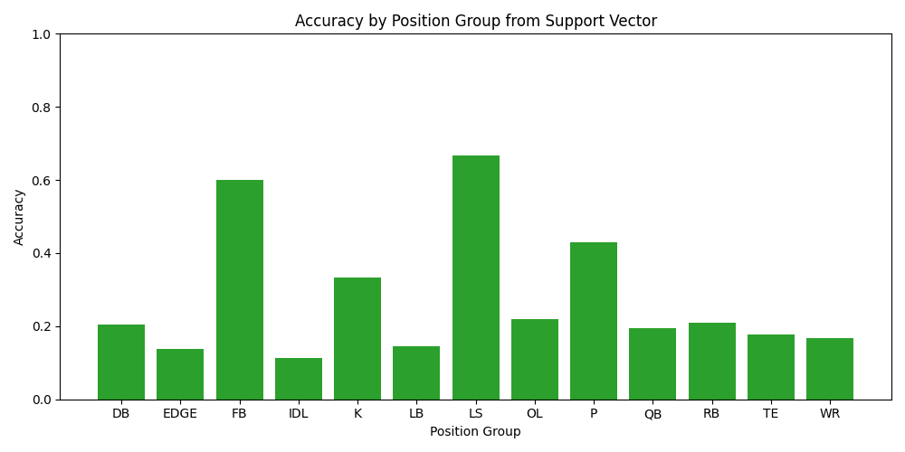
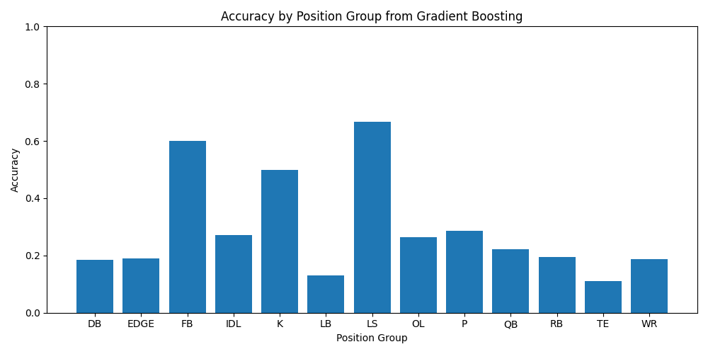
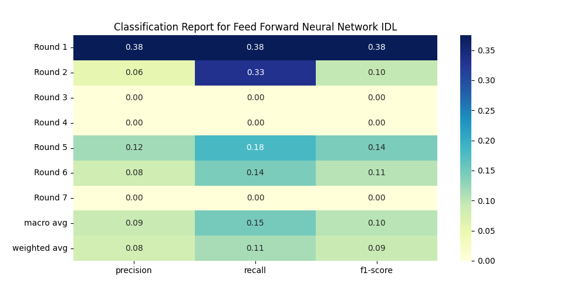

# NFL Draft Classification
## Identifying player round using machine learning and deep learning concepts

data from [sports refrence]([https://www.sports-reference.com/cfb/]).

## Introduction

The NFL Draft is the pinnacle of the football offseason drawing a larger television audience then the oscars and the NBA finals. 
Part of intrigue is the unknown of where these prospects will be drafted and which franchises will they reform. Every year people try to predict the outcomes 
with mock drafts being posted years in advance of the actual date. And the scholarly community focuses more on the predicted NFL performance of the players but just as important is where are these players 
going to be drafted? This question is posed by both prospects and general managers alike. So I hope to answer this by projecting the round in which any given prospects is to be selected. To do 
this i decided to fit different classification models to see which produced the highest accuracy on a given position.


## Data
```
make data
```
To answer this question Data was a necessity and was severely lacking as most scholarly articles use less than 10 features and focus on one position group. I 
wanted to change the scope of this to look at all position groups. To do this I scraped data for prospects drafted between 2014 and 2022; This included every 
possible player statistic for every year of college eligibility and all combine results. This resulted in a dataset that was over 2,000 observations with 252 
features. To achieve this dataset I used beautiful soup and scrape each individual player concatenating each row.
```
make analyze
```
## First Attempts and Adjustments
The first attempts at this project I tried to fit a model without positional stratification and this resulted in a very low accuracy score. 
This was expected as NFL positions require very different skills and ‘acquire’ different statistics. After this I stratified by position but there were 
many groups that had commonality but were labeled as different such as OLB and DE or OG and C. So I made the executive decision to combine these position 
groups to make higher sample sizes of each. I also thought that each class (year of prospects) is distinct so I wanted to standardize based on position and 
year because that is all that is available to draft in a given year so a superior prospect 
in a given year while not a superior prospect overall is likely to be drafted higher.

## SVC
This model did fairly poorly with the major position groups averaging a 20% accuracy. Pictured to the side are the classification reports of DBs and IDL we can 
see the high recall in both cases indicating it is easy to find first rounders



## Gradient Boosting
This we can see the same average accuracy of 20% but better evaluation on other position groups such as OL pictured to the right where the model was very 
successful in predicting late round and first round prospects



## Feed Forward Neural Network
The neural network performed poorly compared to the other models overall. But for distinct position groups the neural network performs rather well such as 
linebackers and edge rushers this makes sense as these positions have lots of statistics due to the nature of the game.
The classification reports pictured to the right are that of edge rushers and interior defensive lineman. We can see once again the model is good at 
predicting first round prospects and late round prospects while struggling for the middle rounds.



## Random Forest
The last model fit was Random Forest and while this model once again had accuracy around 20% we get the added insight of feature importance. These graphs 
are interesting as it shows what is taken into account by each position. Pictured below we can see below that positions like running backs value athleticism 
in all facets with a majority of their important features being combine statistics while a position like punter is entirely based on on-field performance.


## Conclusion
In Conclusion most of the models performed adequately with the highest average accuracy being just above 20% accuracy. There were interesting results 
though as the models for the most part were able to predict first round talents which makes sense as these players are the best of the best. And in 
addition the feature importance was enlightening to what evaluators look at. But the feature importance charts as well as the classification charts 
display that although I used 200 features there are many more that g into the game such as team need which might drive a player to be drafted quicker or
On field athleticism these are hard to quantify and show This field needs further research.
## Further Research
NLP
○ We can use NLP to identify through scouting reports other non
numeric variables that are important in the NFL evaluation
like decision making or arm strength for QBs
Awards
○ For non statistically impactful positions, such as offensive line, quantitative metrics aren’t very suitable so we need to use other evaluation metrics such as awards i.e (all conference appearances, all american) these metrics should give a better insight to these more challenging positions
Conferences
○ All college football statistics are not built equally although
standardized some conferences are harder than others so statistics should be weighted accordingly

